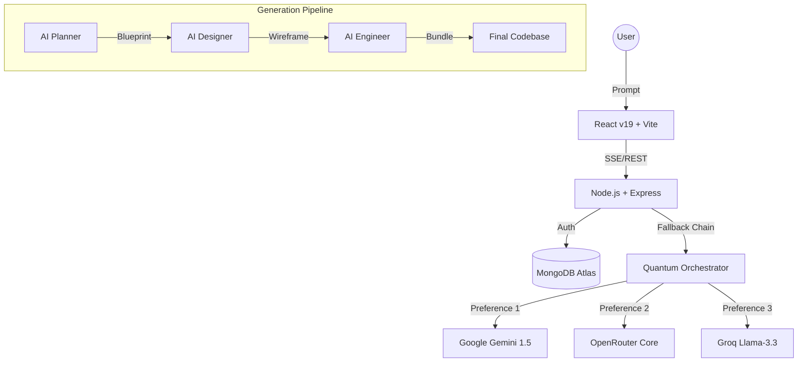

# 🧠 Architecture Overview - Flactuation quantumv1.0

The **Flactuation** project is built with a decoupled architecture aimed at providing high-fidelity AI-native code generation.

---

## 🏗️ System Design

---

## 🛰️ Quantum Orchestrator

The heart of Flactuation-quantumv1.0 is the **Orchestrator Service**. Unlike traditional AI applications, Flactuation uses a **Multi-Agent Fallback Chain**.

- **Reliability Logic**: If a provider (e.g., Gemini) returns a `429` (Quota Exceeded), the orchestrator automatically reroutes the request to the next best provider (e.g., Groq) without user intervention.
- **Task Streaming**: We use **Server-Sent Events (SSE)** to stream generation results in real-time, providing immediate feedback on the UI.

---

## 📦 Service Structure

### 1. **Flactuation-frontend**
A high-performance React application using:
- **Zustand**: For lightweight, global state management (Auth and Workspace).
- **Tailwind CSS**: For a premium, minimalist dark-mode aesthetic.
- **Lucide Icons**: For sharp, modern iconography.
- **SSE Hooks**: For robust real-time communication with the backend.

### 2. **visualflow-backend**
A scalable Node.js/Express application:
- **Passport.js**: For secure JWT authentication and OAuth2 integration.
- **Mongoose**: For structured MongoDB data modeling.
- **TS-Node-Dev**: For rapid development and automatic restarts.

---

## 🧠 Project Memory & Stateful AI

Flactuation doesn't just "generate" and "forget". The **ProjectMemory** model stores key decisions made during the architectural phase:
- **Decision Tracking**: Why a specific tech stack or pattern was chosen.
- **Pattern Learning**: AI agents recognize recurring architectural patterns in your project to improve future suggestions.
- **Atomic Iterations**: Each architectural change is saved as a new version, allowing for rapid rollbacks.

---
*Back to [Getting Started](./getting-started.md)*
